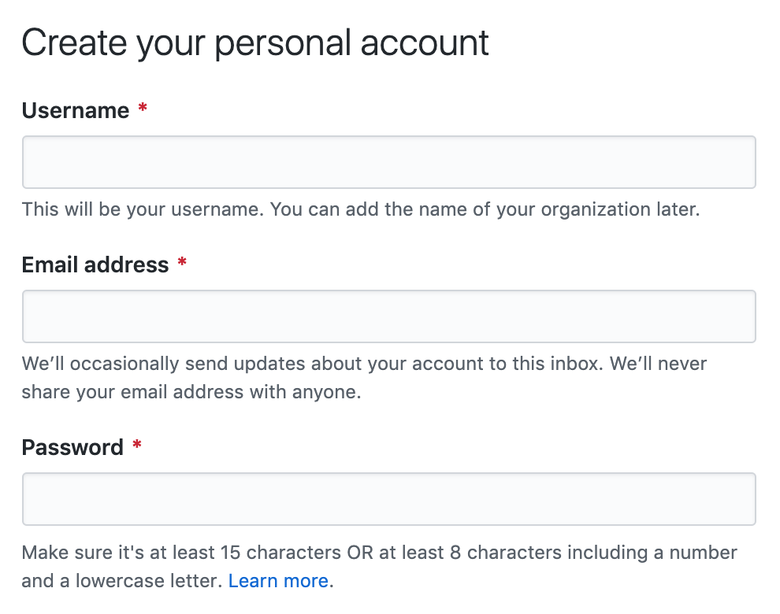
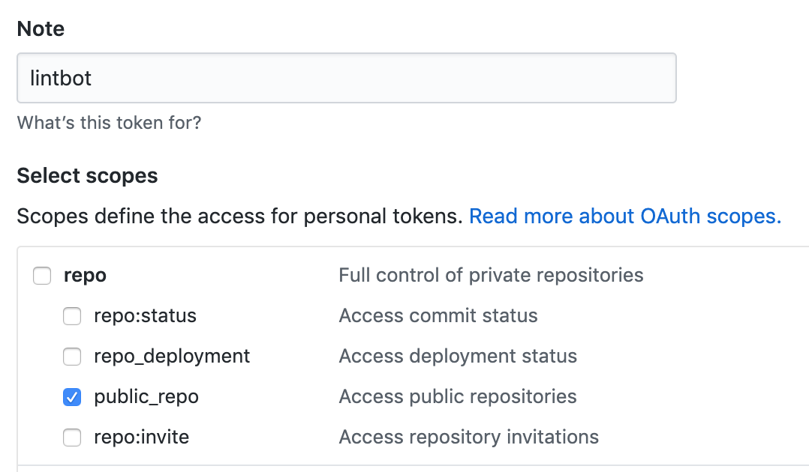

# Setup `lintbot` for GitHub

## TLDR Installation

```sh
# Assuming eslint is configured
npm install --save-dev lintbot

# Create lintbot.js
cat > lintbot.js << EOF
#!/usr/bin/env node
const lintbot = require('lintbot');
const { CLIEngine } = require('eslint');
lintbot({ CLIEngine });
EOF

chmod +x lintbot.js

# Assuming environment variables are set
./lintbot.js github .eslintrc.json
```

## Environment Variables

| Variable | Description |
|-|-|
`LINTBOT_GITHUB_USERNAME` | GitHub username |
`LINTBOT_GITHUB_TOKEN` | Personal access token or password |
`LINTBOT_GITHUB_BASEURL` (optional) | Defaults to https://api.github.com |
`LINTBOT_GITHUB_PRID` | Pull request ID, alias from your CI environment variable |

## Installation with Screenshots

1. Create new account for `lintbot`

  

2. Create [new personal access](https://github.com/settings/tokens/new) token with `public_repo` permission or `repo` for private repos

  

3. Set CI environment variables

4. Configure CI to run lintbot
