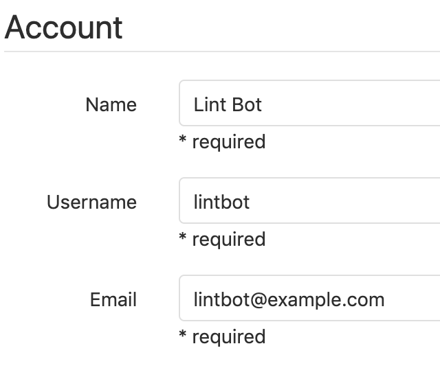
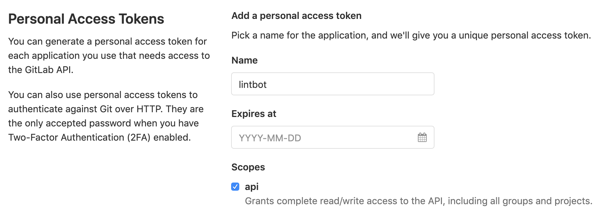

# Setup `lintbot` for GitLab

## TLDR Installation

```sh
# Assuming eslint is configured
npm install --save-dev lintbot

# Create lintbot.js
cat > lintbot.js < EOF
#!/usr/bin/env node
const lintbot = require('lintbot');
const { CLIEngine } = require('eslint');
lintbot({ CLIEngine });
EOF

chmod +x lintbot.js

# Assuming environment variables are set
./lintbot.js gitlab .eslintrc.json
```

## Environment Variables

| Variable | Description |
|-|-|
`LINTBOT_GITLAB_TOKEN` | Personal access token or impersonation token |
`LINTBOT_GITLAB_USER_ID` | GitLab **User ID** number found on the profile page |
`LINTBOT_GITLAB_BASEURL` (optional) | Defaults to https://gitlab.com |
`CI_PROJECT_ID` | Automatically set by GitLab CI |
`CI_COMMIT_REF_NAME` | Automatically set by GitLab CI |
`CI_MERGE_REQUEST_IID` | Automatically set by GitLab CI if `only: [merge_requests]` is used in `gitlab-ci.yml` |

## Installation with Screenshots

1. Create a new account for `lintbot`

    

2. Generate a personal access token or impersonation token with the `api` scope

    

3. Set CI / CD environment variables

    

4. Configure `gitlab-ci.yml`
